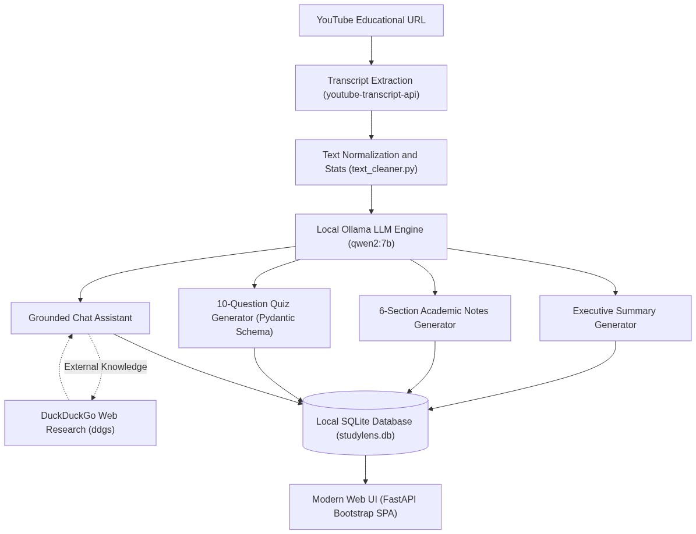

# StudyLens AI

StudyLens AI is a lightweight, local-first educational assistant designed to turn educational YouTube lectures into structured study material and interactive learning experiences. By simply providing a YouTube video URL, the application extracts the transcript using `youtube-transcript-api` without downloading audio or video files. A local Large Language Model running via [Ollama](https://ollama.com) (such as `qwen2:7b`) processes the lecture content to produce structured executive summaries, 6-section academic study notes, 10-question multiple-choice quizzes with instant scoring and explanations, and a lecture-grounded interactive study chat.

The application operates entirely on local hardware with zero paid API keys or third-party cloud tracking. It is built with a fast [FastAPI](https://fastapi.tiangolo.com) backend and a responsive Bootstrap 5 Single Page Application frontend (adhering to an Ollama-inspired minimalist design system). For questions requiring external or comparative context, StudyLens AI automatically performs dynamic web research via DuckDuckGo (`ddgs`) and cites sources alongside transcript evidence. All sessions, notes, summaries, and quizzes are automatically stored locally in SQLite (`data/studylens.db`) for seamless resumption.

---

## Setup Guide

### 1. Prerequisites
- **Python 3.11+** installed on your system.
- **Ollama** installed and running locally:
  - Download and install from [ollama.com](https://ollama.com).
  - Pull the default study model:
    ```bash
    ollama pull qwen2:7b
    ```
  - Start the Ollama background service:
    ```bash
    ollama serve
    ```

### 2. Installation
1. Clone the repository:
   ```bash
   git clone https://github.com/<your-username>/StudyLensAI.git
   cd StudyLensAI
   ```
2. Create and activate a virtual environment:
   - **Windows**:
     ```powershell
     python -m venv .venv
     .venv\Scripts\activate
     ```
   - **macOS / Linux**:
     ```bash
     python3 -m venv .venv
     source .venv/bin/activate
     ```
3. Install dependencies:
   ```bash
   pip install -r requirements.txt
   ```

### 3. Running the Application
Start the application server:
```bash
python -m uvicorn server:app --host 127.0.0.1 --port 8000
```

Open your browser at: **[http://127.0.0.1:8000](http://127.0.0.1:8000)**

---

## Architecture and Workflow

### Architecture Diagram



### End-to-End Workflow

1. **Input & Extraction**: The user provides a YouTube link. The backend extracts captions via `youtube-transcript-api`, cleans whitespace, calculates reading metrics, and stores the initial session in SQLite.
2. **Analysis & Generation**:
   - **Summary**: Synthesizes core concepts, primary points, and key takeaways.
   - **Notes**: Generates structured, textbook-quality notes across 6 distinct academic sections.
   - **Quiz**: Constructs 10 multiple-choice questions validated via Pydantic schemas, with answers revealed only upon submission.
   - **Chat**: Answers questions anchored to transcript context using keyword density chunking. If external or temporal facts are needed, queries DuckDuckGo for live web evidence.
3. **Persistence & Export**: All results are saved in `data/studylens.db` to reopen past sessions, and content can be copied in one click as plain text or Markdown.
